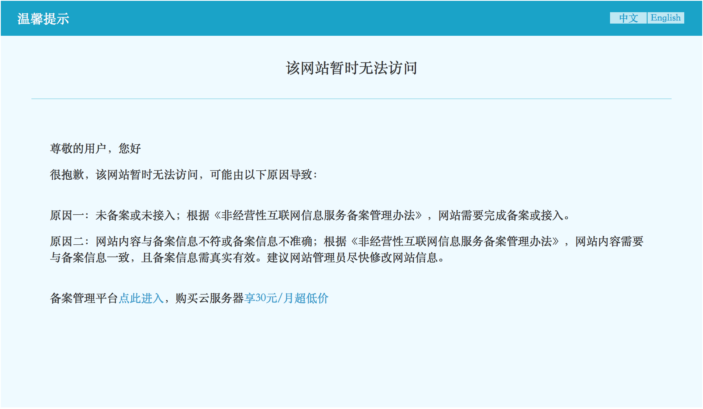
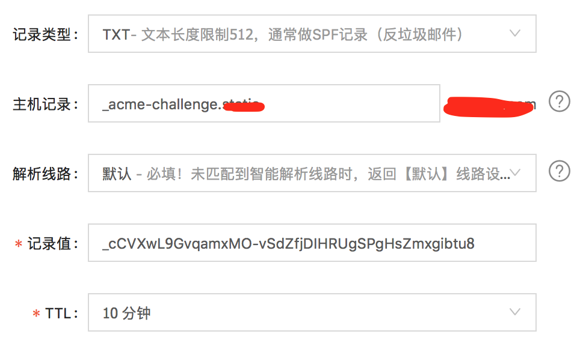

# 如何在未备案的网站上部署免费证书
## 选择证书颁发机构
随着人们安全意识提高，网站已经进入https时代，本文不再赘述https的必要性，仅描述如何部署。

对于不差钱的公司，当然是购买证书省心省力，这类证书一般都是按年付费，价格不菲。对于个人开发者和创业团队，则没必要在这上面投入太多资金，首先考虑免费证书。国内有很多免费证书机构，但约束条件都很多，比如阿里只对第一次注册的用户免费使用3个月，腾讯证书只能部署在腾讯云上，而且国内网站都施行审核制，需要书面申请才给颁发证书，操作起来很麻烦。这里我推荐[Let’s Encrypt](https://letsencrypt.org)家证书。Let's Encrypt采用运用*ACME*协议自动签发、自动续期，申请时，不需要提前准备资料，不需要书面申请。唯一一点注意事项就是Let’s Encrypt规定了每次签发的证书有效期只有三个月，证书生成一个月之后可以免费重签/续期。
## 域名验证方式
申请Let's Encrypt证书时，需要证明域名的确归你所有，有两种方式：

- URL验证：Let's Encrypt生成一个随机内容的文件，我们只要把这个文件放在指定位置，只要用待绑定的域名 + path可以访问到这个文件，即可通过验证。
- DNS检验：Let's Encrypt生成一个随机字符串，我们把这个字符串添加为待绑定域名某个name的txt值，只要能通过公网上的DNS服务器解析到这个字符串，即可通过验证。

从上面两种方式来看，当然URL验证更直观，易操作。但在国内，第一种方式只适用于已备案的网站，因为国内要求网站都必须先备案再发布，以阿里云为例，如果网站未备案或备案中，那网站的80口会被阿里劫持，将返回内容篡改成一个title为“TestPage”的提示页面：

因此未备案的网站只能选择DNS检验方式。
## 申请证书
说了半天，总算要步入正题了，在具体操作之前，介绍三种申请方式：

0. 通过Let's Encrypt官方推荐的cerbot(https://github.com/certbot/certbot)客户端申请。
0. 通过第三方封装的Python脚本申请
### 使用cerbot申请
0. 请确认已安装git
0. 申请证书
```bash
git clone https://github.com/certbot/certbot
cd certbot
./certbot-auto --manual --preferred-challenges dns --expand --renew-by-default  --manual-public-ip-logging-ok certonly --text --agree-tos --email <验证用的email> -d <域名1> -d <域名2> ...
```
### 使用Python脚本申请
强烈推荐通过Python脚本申请，这种方式更方便，成功率更高。

0. 请确认已安装Python 2.6+
0. 安装Python脚本
```bash
pip install --upgrade certbot
```
2. 申请证书
```bash
certbot --manual --preferred-challenges dns --expand --renew-by-default  --manual-public-ip-logging-ok certonly --text --agree-tos --email <验证用的email> -d <域名1> -d <域名2>
```

### 验证域名
运行后，会给以下提示
```bash
Please deploy a DNS TXT record under the name
_acme-challenge.<要申请的域名> with the following value:

667drNmQL3vX6bu8YZlgy0wKNBlCny8yrjF1lSaUndc

Once this is deployed,
Press ENTER to continue
```
这里以阿里云DNS为例，讲解如何实现DNS验证。

0. 点击**添加记录**

0. 保存后等上半分钟，然后执行
```bash
dig -t txt _acme-challenge.<要申请的域名>
```
如果在```ANSWER SECTION```中能看到记录值，说明DNS生效了，否则等会再试。

2. DNS生效后，按回车继续。

流程走完后，在```/etc/letsencrypt/live/<your.domain.com>```下可以看到以下几个文件:

- **privkey.pem** 私钥；
- **fullchain.pem** 带完整认证链的证书。注意，说是fullchain，其实CA是Let's Encrypt自家的CA，在某些老的操作浏览器上仍然有bug；
- **chain.pem** README，上面说法是给nginx stapling用的，其实里面就是CA的证书；
- **cert.pem** 公钥。

虽然可以一次申请多个域名的证书，但只有第一个域名可以通过Chrome验证，访问后面域名时都会弹出安全警告，说这个证书依赖主域名。目前Let's Encrypt也没给出什么解决办法，因此稍微麻烦点，每个域名申请一个证书吧。

## 部署证书
以Nginx为例，配置如下：
```nginx
#打开SSL
ssl on;
#证书位置
ssl_certificate /etc/letsencrypt/live/www.ebizyun.com/fullchain.pem;
#私钥位置
ssl_certificate_key /etc/letsencrypt/live/www.ebizyun.com/privkey.pem; 
#域名证书与ROOT证书之间的认证链，这是CA之间经常使用的一种提高自身兼容性的办法。
ssl_trusted_certificate /www/letsencrypt_full_chained.pem;
#在DHE密钥交换的时候使用的密钥
ssl_dhparam /www/dhparam.pem;

ssl_stapling on;
ssl_stapling_verify on;
ssl_session_timeout 5m;
ssl_protocols TLSv1 TLSv1.1 TLSv1.2;
ssl_ciphers ALL:!DH:!EXPORT:!RC4:+HIGH:+MEDIUM:-LOW:!aNULL:!eNULL;
ssl_prefer_server_ciphers  on;
ssl_session_cache shared:SSL:50m;
```
### 生成ssl_trusted_certificate证书的简单方法
```bash
curl -Lo "${HOME}/lets-encrypt-x3-cross-signed.pem"  "https://letsencrypt.org/certs/lets-encrypt-x3-cross-signed.pem"
curl -Lo "${HOME}/isrgrootx1.pem" "https://letsencrypt.org/certs/isrgrootx1.pem"
sed -i 's@\s*$@@g' "${HOME}/isrgrootx1.pem"
cat ${HOME}/lets-encrypt-x3-cross-signed.pem ${HOME}/isrgrootx1.pem > letsencrypt_full_chained.pem
```
上面的命令原理是假设certbot生成的fullchain.pem里面有以下的规则。

0. 证书都是由letsencrypt CA直接认证的，没有中间的颁发者。
0. 签发证书的letsencrypt CA是lets-encrypt-x3。

所以，当上面的配置出现错误时，最简单的办法是注掉```ssl_trusted_certificate```这行。
### ssl_dhparam密钥
```bash
openssl dhparam -out dhparam.pem 2048
```
因为服务器性能一般，选择了2048位密钥，从安全角度，建议用4096位。